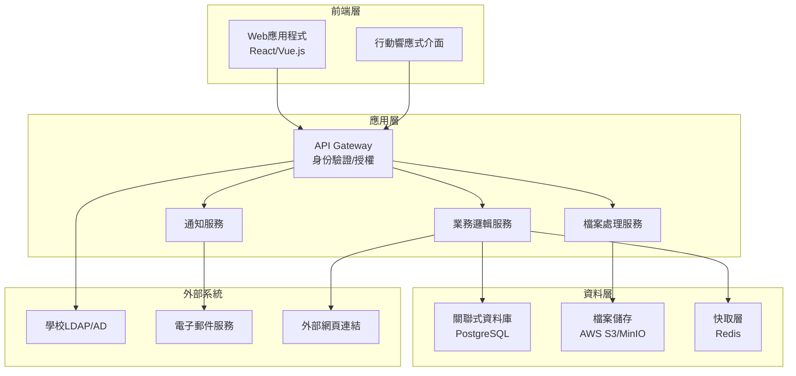
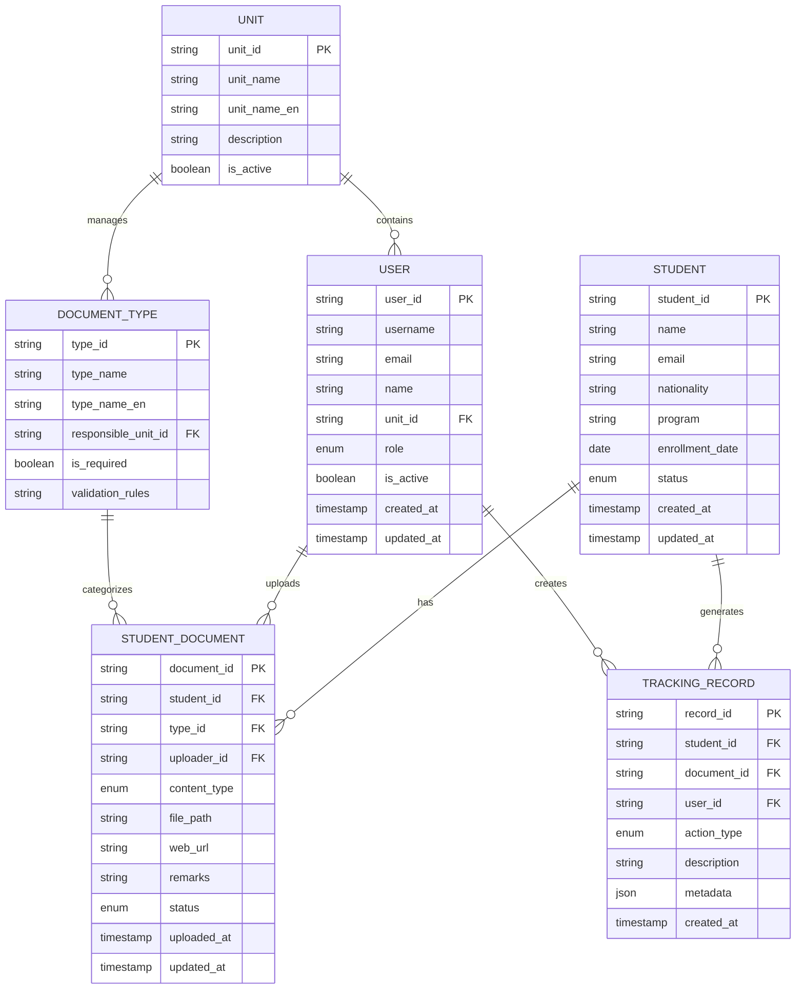

# 外國學生受教權查核系統設計文件

## 概述

外國學生受教權查核系統是一個基於Web的文件管理和追蹤平台，採用以學生為中心的資料架構設計。系統支援多種單位的協作上傳、權限管理、資料追蹤和查核功能。

## 架構

### 系統架構圖



### 技術堆疊

- **前端**: React.js + TypeScript + Ant Design
- **後端**: Node.js + Express.js + TypeScript
- **資料庫**: PostgreSQL (主要資料) + Redis (快取)
- **檔案儲存**: AWS S3 或 MinIO (自架)
- **身份驗證**: JWT + LDAP整合
- **部署**: Docker + Kubernetes 或 Docker Compose

## 元件和介面

### 核心元件

#### 1. 使用者管理元件 (UserManagement)
- **職責**: 處理使用者身份驗證、授權和角色管理
- **介面**:
  - `authenticateUser(credentials)`: 使用者登入驗證
  - `getUserPermissions(userId)`: 取得使用者權限
  - `getUsersByUnit(unitId)`: 取得單位內使用者清單

#### 2. 學生檔案管理元件 (StudentProfileManager)
- **職責**: 管理以學生為中心的資料檔案
- **介面**:
  - `getStudentProfile(studentId)`: 取得學生完整檔案
  - `updateStudentDocument(studentId, documentType, data)`: 更新學生文件
  - `getStudentCompletionStatus(studentId)`: 取得學生資料完成度

#### 3. 文件上傳元件 (DocumentUploader)
- **職責**: 處理檔案上傳和網頁連結管理
- **介面**:
  - `uploadDocument(file, metadata)`: 上傳檔案
  - `addWebLink(url, metadata)`: 新增網頁連結
  - `validateDocument(document)`: 驗證文件格式和內容

#### 4. 追蹤記錄元件 (TrackingManager)
- **職責**: 記錄和查詢所有操作歷程
- **介面**:
  - `createTrackingRecord(action, metadata)`: 建立追蹤記錄
  - `getTrackingHistory(filters)`: 查詢歷程記錄
  - `generateAuditReport(criteria)`: 產生稽核報表

#### 5. 權限控制元件 (PermissionController)
- **職責**: 控制不同單位的資料存取權限
- **介面**:
  - `checkUploadPermission(userId, documentType)`: 檢查上傳權限
  - `getAccessibleDocumentTypes(userId)`: 取得可存取的文件類型
  - `validateUnitAccess(userId, unitId)`: 驗證單位存取權

#### 6. 通知系統元件 (NotificationSystem)
- **職責**: 處理系統通知和提醒
- **介面**:
  - `sendNotification(userId, message)`: 發送通知
  - `scheduleReminder(studentId, documentType)`: 排程提醒
  - `broadcastUpdate(unitId, message)`: 廣播更新訊息

## 資料模型

### 核心實體關係圖



### 資料模型詳細說明

#### Student (學生)
- 儲存學生基本資訊
- 作為系統的核心實體，所有文件都關聯到學生

#### User (使用者)
- 儲存系統使用者資訊
- 包含角色和單位關聯

#### Unit (單位)
- 定義學校各個單位（全球處、註冊組等）
- 與文件類型和使用者建立關聯

#### DocumentType (文件類型)
- 定義18種佐證資料類型
- 指定負責上傳的單位

#### StudentDocument (學生文件)
- 儲存實際的文件或網頁連結
- 包含上傳者、時間、備註等追蹤資訊

#### TrackingRecord (追蹤記錄)
- 記錄所有系統操作歷程
- 支援稽核和報表功能

## 錯誤處理

### 錯誤分類和處理策略

#### 1. 驗證錯誤 (Validation Errors)
- **檔案格式錯誤**: 返回具體的格式要求說明
- **權限不足**: 提供聯繫相關單位的資訊
- **必填欄位缺失**: 明確指出缺失的欄位

#### 2. 系統錯誤 (System Errors)
- **檔案上傳失敗**: 提供重試機制和替代方案
- **資料庫連線錯誤**: 實作自動重連和降級服務
- **外部服務不可用**: 提供離線模式和快取機制

#### 3. 業務邏輯錯誤 (Business Logic Errors)
- **重複上傳**: 提供覆蓋或版本控制選項
- **逾期提交**: 記錄並通知相關人員
- **資料不一致**: 提供資料同步和修正機制

### 錯誤回應格式

```json
{
  "success": false,
  "error": {
    "code": "VALIDATION_ERROR",
    "message": "檔案格式不符合要求",
    "details": {
      "field": "document_file",
      "expected": ["pdf", "doc", "docx"],
      "received": "txt"
    },
    "suggestions": [
      "請上傳PDF或Word格式的檔案",
      "如需協助請聯繫全球處"
    ]
  }
}
```

## 測試策略

### 測試層級

#### 1. 單元測試 (Unit Tests)
- **覆蓋率目標**: 80%以上
- **重點測試**: 業務邏輯、資料驗證、權限控制
- **工具**: Jest + Testing Library

#### 2. 整合測試 (Integration Tests)
- **API端點測試**: 所有REST API的功能測試
- **資料庫整合**: 資料存取層的測試
- **外部服務整合**: LDAP、檔案儲存服務測試

#### 3. 端對端測試 (E2E Tests)
- **使用者流程**: 完整的上傳和查核流程
- **跨瀏覽器測試**: Chrome、Firefox、Safari
- **工具**: Playwright 或 Cypress

#### 4. 效能測試 (Performance Tests)
- **負載測試**: 模擬多使用者同時上傳
- **壓力測試**: 系統極限測試
- **檔案上傳測試**: 大檔案和批量上傳測試

### 測試資料管理

- **測試資料庫**: 獨立的測試環境
- **模擬資料**: 產生符合真實情境的測試資料
- **資料清理**: 每次測試後自動清理測試資料

### 安全性測試

- **身份驗證測試**: 登入、登出、權限驗證
- **資料保護測試**: 敏感資料加密和存取控制
- **輸入驗證測試**: SQL注入、XSS攻擊防護
- **檔案上傳安全**: 惡意檔案檢測和隔離